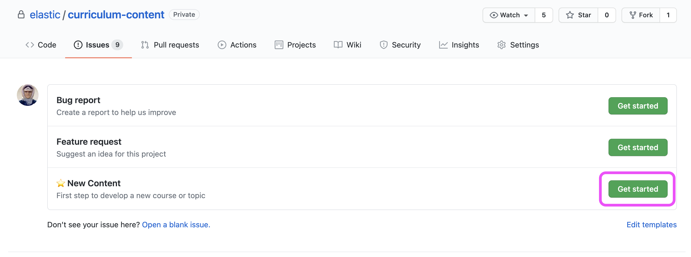
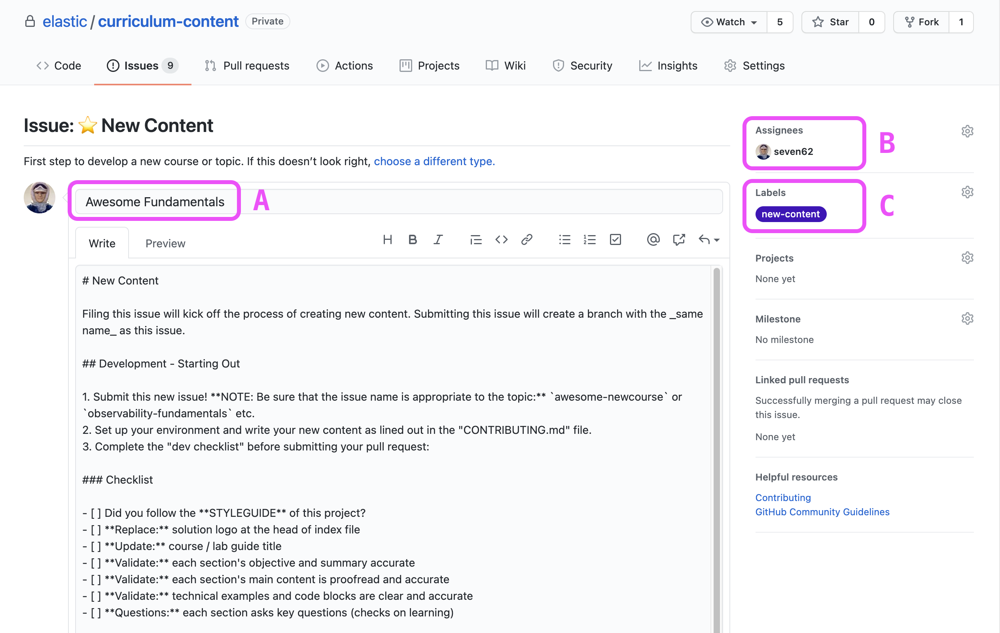
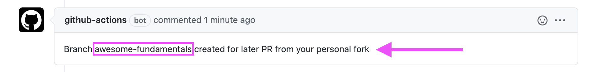
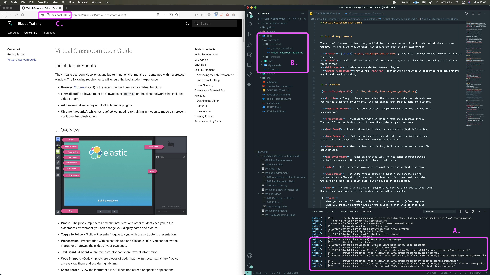
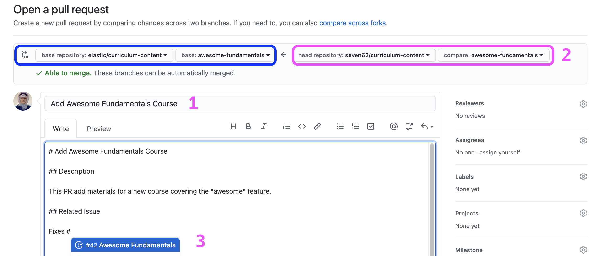

# User Guide - Student Content & Labs

This document aims to serve as a how-to that provides step by step instructions 
on the set up, develop, and submission of updated documentation for this 
project using [MkDocs](https://www.mkdocs.org/) and the 
[Material Theme](https://squidfunk.github.io/mkdocs-material/)). This documentation 
focuses on _macOS_, but if you need support for another development environment, 
file and issue and tell us.

> **Stay tuned for more details on the testing and reviewing process as we work out all the kinks. Join us in the [#curriculum-dev](slack://channel?team=T0CUZ52US&id=C01R6H2G05S) channel!**


## Table of Contents

This table of contents shows an overview of the process:  

- [Setup](#setup)
  - [Initial Issue](#initial-issue) - file an issue to start the process
  - [Install Requirements](#install-requirements) - set up your machine
  - [Git the Things](#git-the-things) - clone repo and setup locally
  - [Docker Setup](#docker-setup) - login to elastic container registry
- [Developing Content](#developing-content)
  - [Project Structure](#project-structure) - key directories
  - [New Course Setup](#new-course-setup) - copying template directory
  - [Ready for Launch](#ready-for-launch) - fire up development server 
  - [Creating Content](#creating-content) - making the things
- [Backend Setup](#backend-setup)
  - [Manual Builds](#manual-builds) - building and publishing outside of CI
- [Submit Changes](#submitting-changes)
  - [Changes Workflow](#changes-workflow) - order of events and key dirs
  - [Checklist](#checklist) - checking your work is ready
  - [Pull Request](#pull-request) - propose new content / changes via PR


> **Note:** The following instructions use the fictional and generic (and _awesome_) "`awesome-fundamentals`" course. Replace this with your 
course name :ok_hand:


---


## Setup


### Initial Issue

> A general video overview of the steps covered in this section is located in gdrive [HERE](https://drive.google.com/file/d/1HL_CdMg81jzMOGqPIAqvF4jNrSFQrjzn/view?usp=sharing). _needs updating_

File a new issue to this repo. This is a crucial step that will enable a follow-on PR to submit
content as a new course.  

1. Click on the "Issues" tab and the "New Issue" button in this repo to create
a new issue.

2. Select the "New Content" issue template:

<p align="center">

</p>
<br>

3. Fill in the issue details:

<p align="center">

</p>
<br>


  - **A.** Name your issue to match the course of topic.  
    - this will auto-create a new brach for later PR  
    - the title is important... it will be the name of the content branch  
    - ex: Issue "Awesome Fundamentals" becomes `awesome-fundamentals` branch  
  - **B.** Assign the issue to yourself!  
  - **C.** Note that the "new-content" label is already applied  

<br>

4. If you have completed the above steps correctly, Github Actions will notify
that the destination branch for your eventual PR has been created!

<p align="center">

</p>
<br>


### Install Requirements

> A general video overview of the steps covered in this section is located in gdrive [HERE](https://drive.google.com/file/d/15Z2nd-nYHPIWrQtBce45Frd0X8ZSlCAs/view?usp=sharing). _needs updating_


This section assumes that you are using macOS. Use the [brew](https://brew.sh/)
package manager where noted below (and generally whenever possible).  

1. Install Git: $ `brew install git`
    - instructions for installing brew can be found [here](https://brew.sh/)
    - install can be confirmed by running: `git --version`

2. Install Docker Desktop
    - instructions [here](https://docs.docker.com/docker-for-mac/install/)
    - ensure docker is installed and running with $ `docker -v`

    After the above docker installation, verify that docker-compose is working 
    o.k. by running `docker-compose --version`. Compose was installed with the 
    above docker client.

3. Have a terminal handy. Many full-time macOS users would probably recommend [iterm2](https://iterm2.com/), but 
`Terminal.app` gets the job done too.  

4. Have a favorite editor. It doesn't matter if it's `vim`, VScode, or something else.

> If you're a VScode user, you may want to consider using it's integrated terminal, which can be
shown with the `ctrl + tilde` keyboard shortcut.  

<!-- 5. Yaml linting - it can be helpful to use linting tools to check best practices 
and validate syntax. This is technically _optional_, but may be implemented as 
a pre-commit git hook: $ `brew install yamllint` -->


### Git the Things

> A general video overview of the git and follow-on docker setup is located in gdrive [HERE](https://drive.google.com/file/d/1RdMgvbi3TWTVymmjl-5A_Dr94Y5-omxl/view?usp=sharing). _needs updating_

1. Clone the repo locally by copy / pasting the full command by clicking "Clone" 
in the top right corner of the web UI:  
    - example: `git clone git@github.com:elastic/curriculum-content.git`

2. Change directory into the project folder:  
    - example: `cd curriculum-content/`

3. Checkout the new course branch that was created in the previous step:  
    - example: `git checkout --track remotes/origin/awesome-fundamentals`
    - confirm your active branch with: `git branch`
    - _note: all remote branches can be viewed with:_ `git branch -av`

4. Finally, add your local project to your favorite code editor. You will
split-screen write and edit your editor markdown in one window, alongside a
browser tab pointing at the running MkDocs local development server
(more on that soon). If your not a hardcore `vim`er, or don't have a favorite
editor, here are some suggestions (#education team holy wars... _BEGIN!_):

    - [Atom](https://atom.io/)
    - [VS Code](https://code.visualstudio.com/)
    - [Sublime Text](https://www.sublimetext.com/)
    - [Notepad++](https://notepad-plus-plus.org/)


### Docker Setup


#### Repository

The sponsored fork is available to all Elasticians at: https://github.com/elastic/mkdocs-material-insiders-ia. 

Resulting docker images will be published using the Github Container Registry (ghcr.io). They can then be pulled for local content creation, as well as accessed in automated build workflows.  


#### Access Tokens

You need to create a personal access token (PAT) with SSO enabled. We will create a token with the minimum permissions needed to pull the latest mkdocs image in order to just get working. (If you find yourself needing more rights to tune or create new images, reference the [developer-guide](developer-guide.md).


1. Navigate to your Github acct:
  - Settings > Developer settings > Personal access tokens
2. Add the `read:pkg` scope
3. Activate SSO Login
4. ENSURE that you capture this PAT value somewhere, like a password manager!

Detailed instructions are maintained [here](https://docs.github.com/en/packages/working-with-a-github-packages-registry/working-with-the-container-registry) and [here](https://squidfunk.github.io/mkdocs-material/insiders/getting-started/#requirements).  


#### Authentication

The following steps are a practical summary, full instructions are found in the GH docs [here](https://docs.github.com/en/packages/working-with-a-github-packages-registry/working-with-the-container-registry).

1. Ensure the Docker Desktop is running.

2. Create an environment variable that will store _your_ PAT.
  - `$ export CR_PAT=YOUR_TOKEN`

3. Login to the registry:
    - `$ echo $CR_PAT | docker login ghcr.io -u USERNAME --password-stdin`
    - ```> Login Succeeded```

Now, you will be able to pull mkdocs images from the container registry!  


---

## Developing Content

> A general video overview of the steps covered in the next sections is located in gdrive [HERE](https://drive.google.com/file/d/1ViNG0FtQIZHHM_avXmCDYWmdNvkY1fg-/view?usp=sharing). _needs updating_


### Project Structure

Take a moment to look at the annotated structure below:  

```
./curriculum-content/
├── _archive/
├── _COURSE_TEMPLATE/         <-- template for new course
│   ├── 01-section-title/
│   ├── 02-section-title/
│   └── mkdocs-COURSE.yml     <-- template config file
│
├── docs/                     <-- contains "common" content
├── site/                     <-- html output dir (when running `mkdocs build`)
├── docker-compose.yml
├── mkdocs.yml                <-- primary mkdocs configuration file
├── USER_GUIDE.md             <-- YOU ARE HERE <3
├── STYLEGUIDE.md             <-- outlines all structure and syntax
└── README.md
```


### New Course Setup

Now that we're all set up locally in your own development branch, let's look at 
a summarized view of the workflow. Note: all steps are performed from the top level of 
the cloned repo:  

1. Copy and rename the "_COURSE_TEMPLATE/" directory to a new course name:  

    - run: `cp -aR _COURSE_TEMPLATE/ awesome-fundamentals`

2. Move the template mkdocs config up to repo root level:  

    - run: `mv awesome-fundamentals/mkdocs-COURSE.yml ./mkdocs-awesome.yml`

3. Edit this new `mkdocs-awesome.yml` file to meet content of new course, the best approach is using search & replace in editor:  

    - update the "`COURSE_TITLE`" placeholders to the _full_ course title
      - ex: `COURSE_TITLE` --> `Elastic Security Analyst`
    - search and replace all "`COURSE_NAME`" entries with new course folder
      - ex: `COURSE_NAME` --> `esa`
    - 2 section folders are provided, duplicate this as needed
    - update course name in `COURSE_NAME/reference/mkdocs.yml` (if uncommented for use)


### Ready for Launch

1. From the root level of the repo, start the local dev (preview) server:

    - ensure Docker Desktop app is running
    - run: $ `CONFIG=mkdocs-awesome.yml docker compose up`
      - **replace** the above CONFIG value to _your_ course yaml
      - this will pull all image layers and spin up a container
      - the server is up and listening for changes on all files

    ```bash
    mkdocs_1  | INFO    -  Serving on http://0.0.0.0:8000
    mkdocs_1  | [I 210505 22:20:53 handlers:62] Start watching changes
    ...
    ...
    ```

2. Alternatively, you can set a local shell variable, that will allow for a 
less typing:  

  - run: $ `export CONFIG=mkdocs-dak.yml`
  - run: $ `docker compose up`


**Note**: The above compose command will capture your prompt as it is running 
in the foreground. Use `ctrl + c` to stop this _foreground_ process. If you 
don't want to lose you current prompt, start the container as a _background_ service with: `docker-compose up -d`.

> The -d specifies "detached" mode. When you're ready to kill the detached server,
run `docker compose stop`.


### Creating Content

1. This is where you start doing ***real work***. Browse to http://localhost:8000 to open the live
preview of the site (template). It's a refreshingly simple workflow that looks like this:  

<p align="center">

</p>
<br>

  - A. local docker container is running dev environment
  - B. working with files in the `<COURSE_NAME>/` folder 
    - (or `docs/` for common content)
  - C. browse to `localhost:8000` for live server previewing
  - D. edit file(s) > save changes > check browser for immediate results

3. Using the [STYLEGUIDE](STYLEGUIDE.md) as a reference, begin building your content by writing,
testing, and polishing. Edit the markdown content, then saving your changes periodically to check
***exactly how the end product looks*** in your browser. `CMD + Tab` is your friend :rocket:

  - write `.md` content in your editor, and then **File > Save**
  - tab over to your browser to see the auto-updated page


## Backend Setup

This section is just an FYI, and pointer over to the [Developer Guide](def-stuff/README.md) 
document. It covers some required administrative tasks such as:  

- updating Github Actions workflow files (build and publish)
- creating / confirming destination S3 buckets


### Manual Builds

Sometimes it may be necessary to build all the HTML files locally. If you've followed 
the steps above using the "`docker compose`" command, you already have the required 
docker image on your machine. You can execute that container in other ways.

#### Requirements

1. AWS CLI
  - [official package](https://docs.aws.amazon.com/cli/latest/userguide/getting-started-install.html)
  - alternative: $ ` brew install awscli
  - authenticate to `elastic-education` team

2. Access to the Elastic MkDocs docker image
  - pulled locally during the above [docker setup](#docker-setup) steps


#### Build & Publish

   In order to build your latest changes to the `site/` directory, we need to 
get a few pieces of information, build files, and then push to the proper S3 bucket.  

1. Get the ID of the local mkdocs docker image.

    - $ `docker image list`
      ```
      REPOSITORY                                    TAG       IMAGE ID       CREATED       SIZE
      docker.elastic.co/education/mkdocs-insiders   0.9.2     22cd42c8d859   3 weeks ago   112MB
      ```

2. Identify the course config file you're going to point to, example `mkdocs-awesome.yml`

3. Now, we can use the `docker run` command to execute the build for your 
course. Based on the above example information, the command to build would be:  

    - $ `docker run --rm -v $PWD:/docs 22cd42c8d859 "build" "-f" "mkdocs-awesome.yml"`

2. The next step is to interact with the S3 and sync the newly built files over.

    - list contents: $ `aws s3 ls s3://curriculum-infra/content/<COURSE>/`
    - sync local to bucket: $ `aws s3 sync site/ s3://curriculum-infra/content/<COURSE>/`


---

## Submitting Changes

> A general video overview of the steps covered in this section is located in gdrive [HERE](https://drive.google.com/file/d/1z7Lmp9S3LK46CAeHZOP_j-E_6TuzHx3i/view?usp=sharing). _needs updating_

As you build great things with the above workflow, you'll need to incrementally commit and push up to your branch.

- example: `git push` _or more verbosely:_
- example: `git push -u origin awesome-fundamentals`


### Changes Workflow

Here's a high-level overview of the change submission process:  

1. When you commit changes, it will kick off a github actions workflow:  
  - detects what course directory has changed files
  - run a `mkdocs build` test on that course
    - if the build fails:
        - STOP
    - if succeeds
        - PUBLISH to S3 course sub-bucket


### Checklist

The review process starts with you. Make sure that you have completed the general list of tasks before
submitting your PR.

- [ ] **Formatting:** Did you follow the **STYLEGUIDE** of this project?
- [ ] **Replace:** Solution logo at the head of index file
- [ ] **Replace:** All placeholder images in index file
- [ ] **Update:** Course / lab guide title
- [ ] **Validate:** Each section's objective and summary accurate
  - [ ] **Validate:** Each section's main content is proofread and accurate
  - [ ] **Validate:** Technical examples and code blocks are clear and accurate
  - [ ] **Questions:** Does each section asks key questions (checks on learning)?
  - [ ] **Workflow:** Does each section asks key questions (checks on learning)?
- [ ] A destination S3 bucket exists for the course
- [ ] Course directory has been added to actions workflow file 


### Pull Request

When you think it's ready for team review, submit your work for review and testing via [Pull Request](https://guides.github.com/introduction/flow/).

<p align="center">

</p>
<br>

1. Add a descriptive name to the PR and fill out template body.

2. Use the Github web interface to submit an official PR to request the merging of all your changes ***from*** your 
branch ***to*** the main repo (`elastic/curriculum-content`): 

3. Link your original issue to this PR using [Github Keywords](https://docs.github.com/en/github/managing-your-work-on-github/linking-a-pull-request-to-an-issue#linking-a-pull-request-to-an-issue-using-a-keyword).  

<br>


<!-- Let's look at a high-level overview of the content dev process:  

1. File a new issue to this repo based on the provided issue template
    - your issue title is important and should match the topic
    - add the `new-content` label to your issue
    - a brach will be auto-created with a title matching your issue name
2. Fork this repository to your personal account and clone locally
3. Create a new branch off of the main branch with the same name as your new issue i.e. "awesome-fundamentals"
4. Dive into the [USER-GUIDE](USER-GUIDE.md) for full instructions
5. As you write your content, refer to the [STYLEGUIDE](STYLEGUIDE.md) structure and syntax examples.
6. When you're ready, submit a PR from your fork to the issue branch!

At that point, the review and testing phase begins:

- codeowner PR reviewing
- AMI functions checks
- validating in Strigo event
- final checklist _(TBD)_ -->
