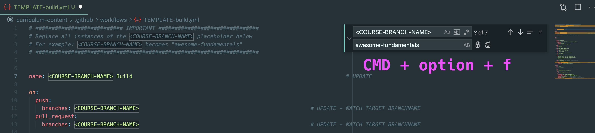

# Content Infrasture Development

This document covers the organization and maintainance of the new content workflow.  


## Contents

- [PR Approval Process](#pr-approval-process) - checklist to merging in changes and new content
  - [S3 Buckets](#s3-bucket-setup) - configuring / confirming destination for html content
  - [Actions Workflow Updates](#actions-workflow-updates) - adding a new course to actions
- [MkDocs Dev Cycle](#mkdocs-development-cycle) - building custom docker image with insiders features  


---

## PR Approval Process

TODO: This will cover the "backend" steps required to fully approve a PR for new 
or changed content.


### S3 Bucket Setup

One of the required steps for a new course to be published is for a (destination) 
sub-bucket to be created within the S3 bucket [curriculum-infra](https://s3.console.aws.amazon.com/s3/buckets/curriculum-infra?region=eu-central-1&tab=objects).  

1. Navigate to S3
2. Search for "`curriculum-infra`" and select
3. Click the "`content/`" directory
4. Click "Create folder" 
  - enter folder name (matches course dir name in this repo)
  - encryption is not necessary
5. Click "Create folder"


### Actions Workflow Updates

_This section is a work in progress, final destination for primary maintainers of 
course content._ TODO UPDATE

Both this project, and it's sister "`curriculum-infra`" repo use Github Actions to automate key tasks. All of these 
instructions for each course are located in a single workflow file in: [.github/workflows/](.github/workflows/).
This content repo uses a custom environment to build your course site _--> then -->_ push that new content to the 
appropriate S3 bucket (where a Strigo instance pulls from on launch). 

<!-- We need duplicate the "`TEMPLATE-build.yml`" file and update the `<COURSE-BRANCH-NAME>` placeholders in the file:

1. Copy the course build template and name according to your course:
  - `cp .github/workflows/TEMPLATE-build.yml .github/workflows/awesome-fundamentals-build.yml`

2. Edit this new yaml file and replace all `<COURSE-BRANCH-NAME>` entries with your course branch name:  
  - open `.github/workflows/awesome-fundamentals-build.yml` in editor
  - replace all 5 placeholder entries, for example:
    - old: `DEST_DIR: 'content/<COURSE-BRANCH-NAME>/'`
    - new: `DEST_DIR: 'content/awesome-fundamentals/'`

<p align="center">

</p>
<br> -->


---

## MkDocs Development Cycle

The mkdocs-material-insiders project has been sponsored by the `elastic-sponsorship` org in order to unlock additional features for use in creating education student content. This section covers how to access the Elastic fork, authenticate, and build / publish container images.  


### Setup

#### Repository

The sponsored fork is available to all Elasticians at: https://github.com/elastic/mkdocs-material-insiders-ia. 

The resulting docker images will be published using the Github Container Registry (ghcr.io). They can then be pulled for local content creation, as well as accessed in automated build workflows.  


#### Access Tokens

If you are involved in creating and tuning docker images, you will need to create a personal access token (PAT) with SSO enabled. More detailed instructions are maintained [here](https://docs.github.com/en/packages/working-with-a-github-packages-registry/working-with-the-container-registry) and [here](https://squidfunk.github.io/mkdocs-material/insiders/getting-started/#requirements).  

1. Navigate to your Github acct:
  - Settings > Developer settings > Personal access tokens
2. Add Repo Scope
3. Add Package Scope
4. Activate SSO Login
5. ENSURE that you capture this PAT value somewhere, like a password manager!


#### Authentication

The following steps are a practical summary, full instructions are found in the GH docs [here](https://docs.github.com/en/packages/working-with-a-github-packages-registry/working-with-the-container-registry).

1. Create an environment variable that will store _your_ PAT.
  - `$ export CR_PAT=YOUR_TOKEN`

2. Login to the registry:
    - `$ echo $CR_PAT | docker login ghcr.io -u USERNAME --password-stdin`
    - ```> Login Succeeded```


> With the setup steps complete, you can move on to working with building, tagging, managing docker images!


### Docker Building

1. Clone the elastic-mkdocs repo locally:
  - `git clone git@github.com:elastic/mkdocs-material-insiders-ia.git mkdocs-elastic`

2. Checkout the `education` branch
  - `git checkout -t origin/education`

3. Make your desired changes, such as adding plugins to the requirements.txt file, etc.

4. Run the build command with next versioning tag
  - `docker build -t education-mkdocs:"v$(date +%Y%m%d%H)" .` (tag on build)
  - _local image created..._
  - `docker image list`

5. This local image can now be used for developing [Curriculum Content](https://github.com/elastic/curriculum-content/blob/main/USER-GUIDE.md)!


> **NOTE:** If you didn't tag the image on build, you can apply one to the image after the fact by running: `$ docker tag IMG_HASH education-mkdocs:"v$(date +%Y%m%d%H)"`


### Docker Image Testing

For the most part, you can just follow the instructions over in the above content USER-GUIDE. But a key additional step is to update the docker-compose file's 
[image value](https://github.com/elastic/curriculum-content/blob/5ab83ef579af4c7c075ed0f48372ad6adab448dc/docker-compose.yml#L6) to point to your local testing 
image. A quick example snippet:  

```yml
services:
  mkdocs:
    image: education-mkdocs:v2022012610
    ...
    ...
```


### Docker Publishing

After fierce and thorough testing, it's time to publish the docker image to the registry so it can be pulled by the team. The GHCR will store images for the project, 
making it available to internal Elasticians. 

The proper way to review and update the education specific docker image is to submit a PR to the ** education branch** of the mkdocs-material-insiders-ia repo. On approval and merge, the [elastic-publish](https://github.com/elastic/mkdocs-material-insiders-ia/blob/main/.github/workflows/elastic-publish.yml) Actions workflow will cut a new image to the registry and replace the latest `:education` tag.  

#### Manual Push

If for some reason the Actions CI isn't working, images can be pushed manually. As you can see in the below commands, the `:education` tag should be used for all education team images:  

1. Get ID of newly built (and vetted) mkdocs image: 
  - `$ docker image list`

2. Tag the image for registry upload:  
  - `$ docker tag education-mkdocs:vTIMESTAMP ghcr.io/elastic/mkdocs-material-insiders-ia:education`

3. Push the image:  
  - `$ docker push ghcr.io/elastic/mkdocs-material-insiders-ia:education`


### Actions CI Credentials

changed to use elastic-wide repo / registry

@seven62 acct:
generated CUSTOM_GHCR_TOKEN token
    no expire
    read:packages (ONLY)
    SSO activated
    key: CUSTOM_GHCR_TOKEN
    value: captured in BW


content repo secrets:
Actions secrets > New repo secret
    key: CUSTOM_GHCR_USERNAME
    value: CUSTOM_GHCR_USERNAME


