# Lab Environment

## Strigo UI Overview

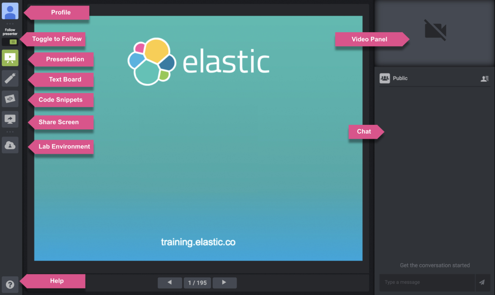

- **Profile** - The profile represents how the instructor and other students see
you in the classroom environment,  you can change your display name and picture.

- **Toggle to Follow** - "Follow Presenter" toggle to sync with the instructor's
presentation.

- **Presentation** - Presentation with selectable text and clickable links.
You can follow the instructor or browse the slides at your own pace.

- **Text Board** - A board where the instructor can share textual information.

- **Code Snippets** - Code snippets are pieces of code that the instructor can
share. You can always view them and  use during lab time.

- **Share Screen** - View the instructor's lab, full desktop screen or specific
applications.

- **Lab Environment** - Hands on practice lab. The lab comes equipped with a
terminal and a code editor connected  to a cloud server.

- **Help** - Click to access available information of the Virtual Classroom.

- **Video Panel** - The video stream source is dynamic and depends on the
instructor's configuration. It can be  the instructor's video feed, a student
who asked to speak or a split feed while in a one on one session.

- **Chat** - The built-in chat client supports both private and public chat rooms.
Use it to communicate with  the instructor and other students.

!!! **Note:**
    When you are not following the instructor's presentation (often happens
    when you change to another area of the course) a sign will be displayed.
    In order to continue to follow the presentation just toggle the switch.

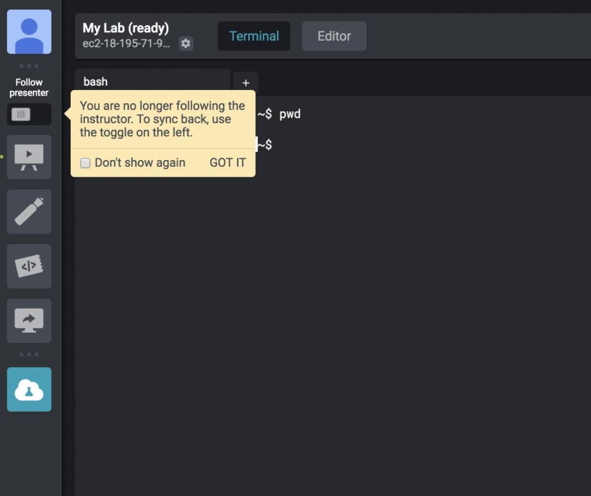

## Chat Tips

Both public and private text chat is available in the virtual classroom platform, but 
audio chat is not supported.

- *How to start/view messages*

. Click on the icon of a person, located on the top right under the video panel.
. Click on "Public" for public chat or on the name of the person.
 
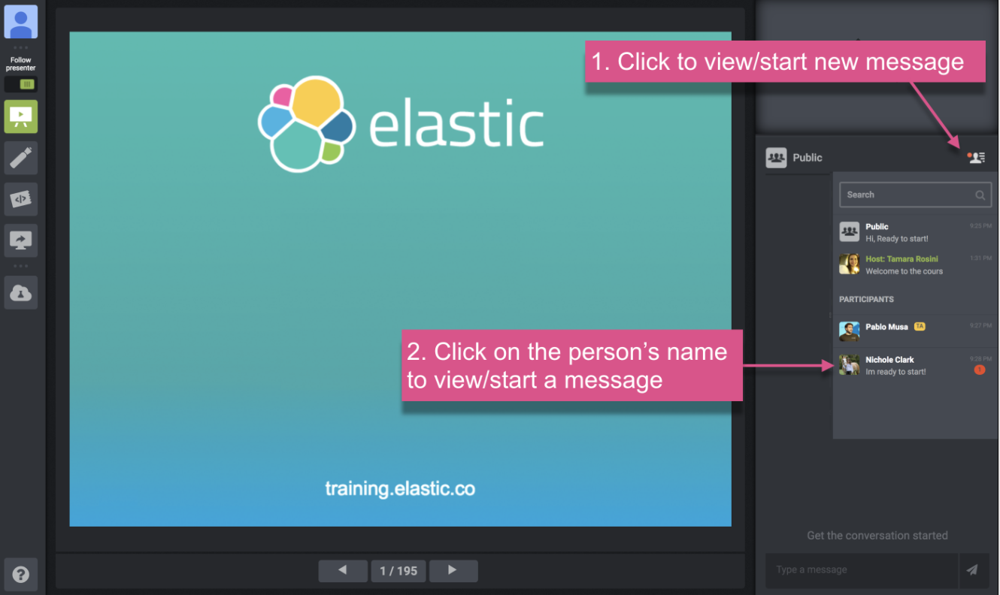
 
When you are in the private chat the name of the person will show on the left
top of the chat box.
 
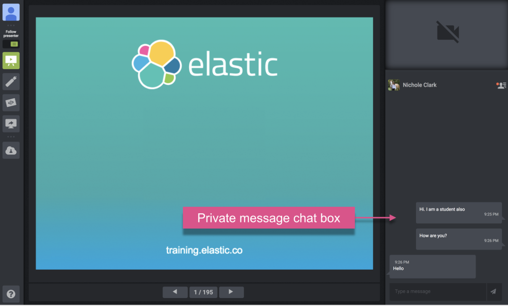

- *Public chat good practices*
 
During the course the instructor asks the students to use the following
characters for better feedback:
 
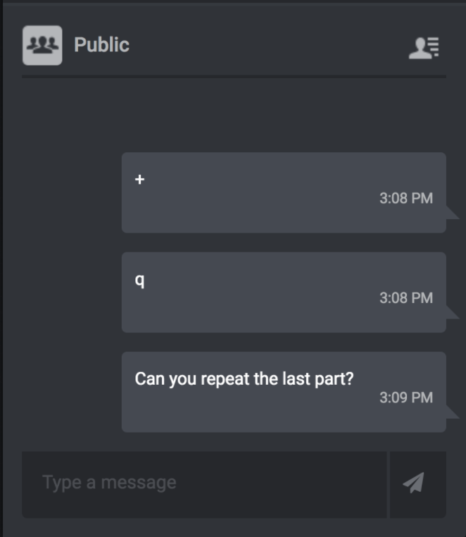
 
** * * - Sign the instructor you are (following/agreeing) 
** *q* - Type a "q" before a question, so you have time to elaborate your
question and the instructor wait for it.

## Lab Environment

The lab environment is an Ubuntu Linux virtual machine.

### Accessing the Lab Environment
 
1. Click on the "My Lab" button

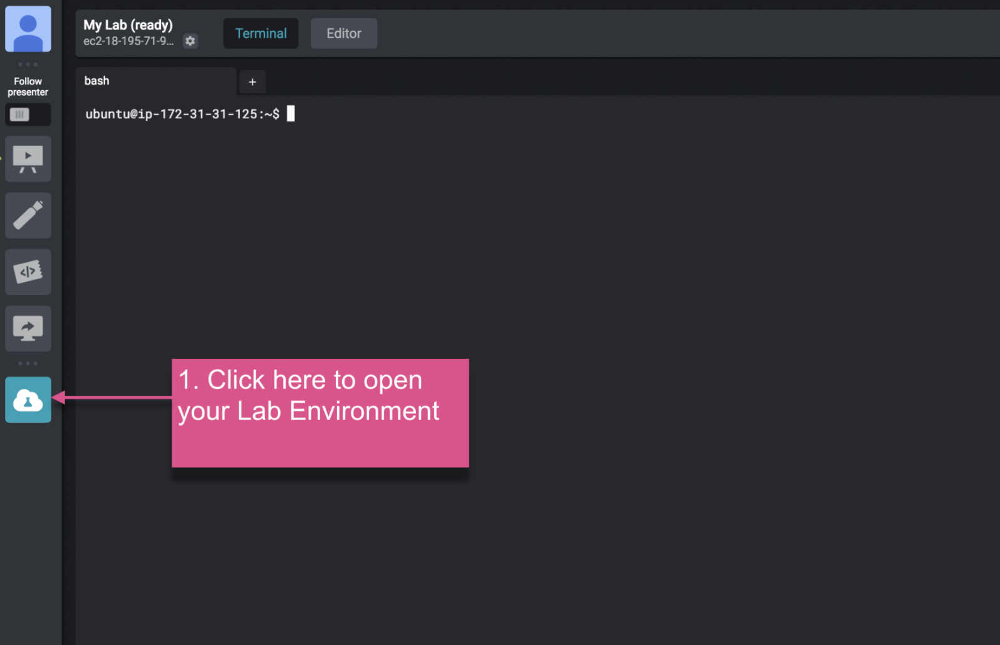

### Lab Instructor Help

In the event any assistance is needed during the course, you can request assistance and work 
side by side with an instructor. When an instructor is connected to your lab session, you 
will see the following sign:

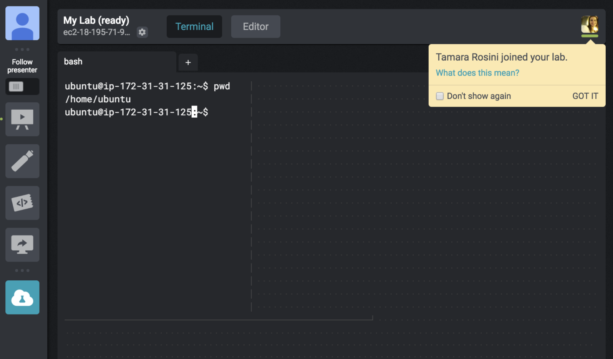

## Home Directory

Your files are located under your home directory or "++tilde++". You can easily change back 
to your "home" at any time by executing the command "`cd`" in the terminal.

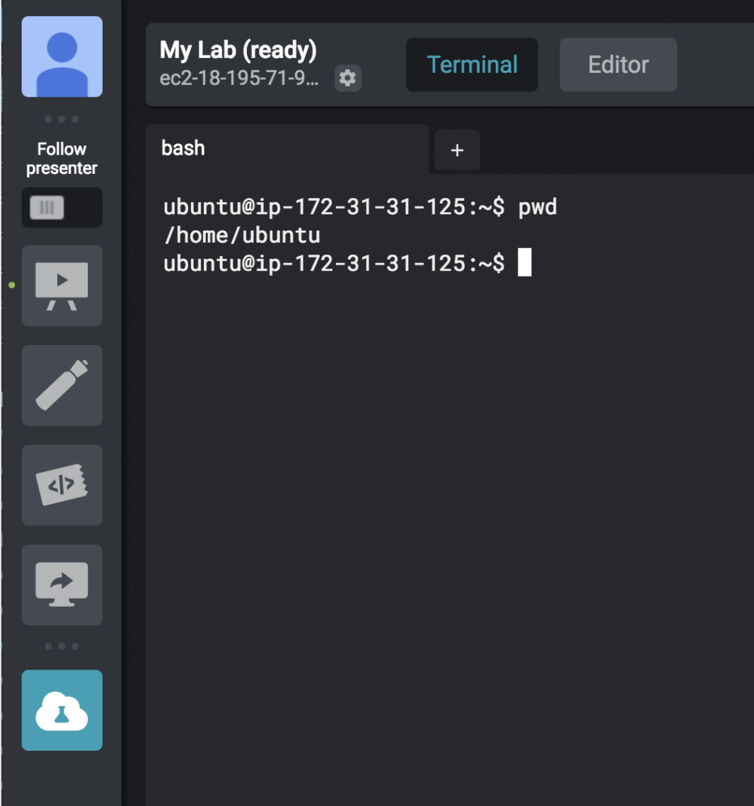

## Open a New Terminal Tab

1. Click on the "My Lab" button.
1. Click on "++plus++" sign.

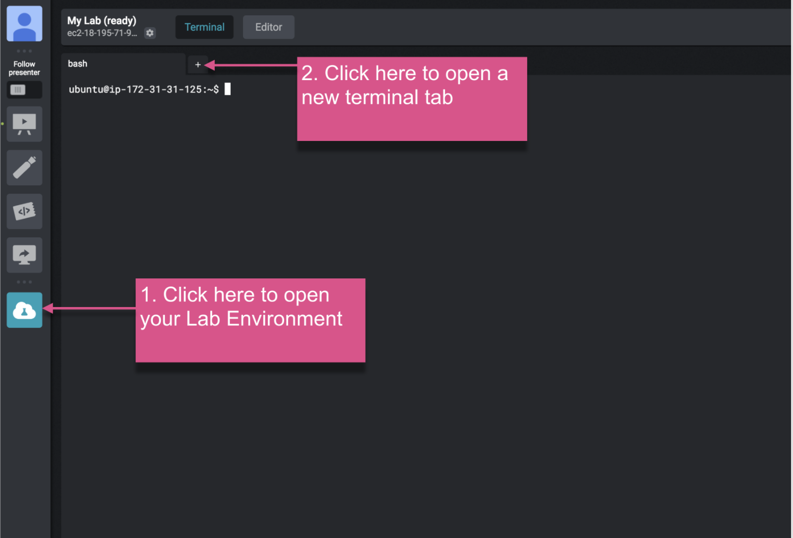

## File Editor

To manage files, you can use standard editors like "`nano`" and "`vim`" within the provided terminal, 
but another option provided is the embedded file editor within the Virtual Classroom.

### Opening the Editor
 
1. Click on the "My Lab" button.
1. Click on "Editor" button, located in the top of the page.

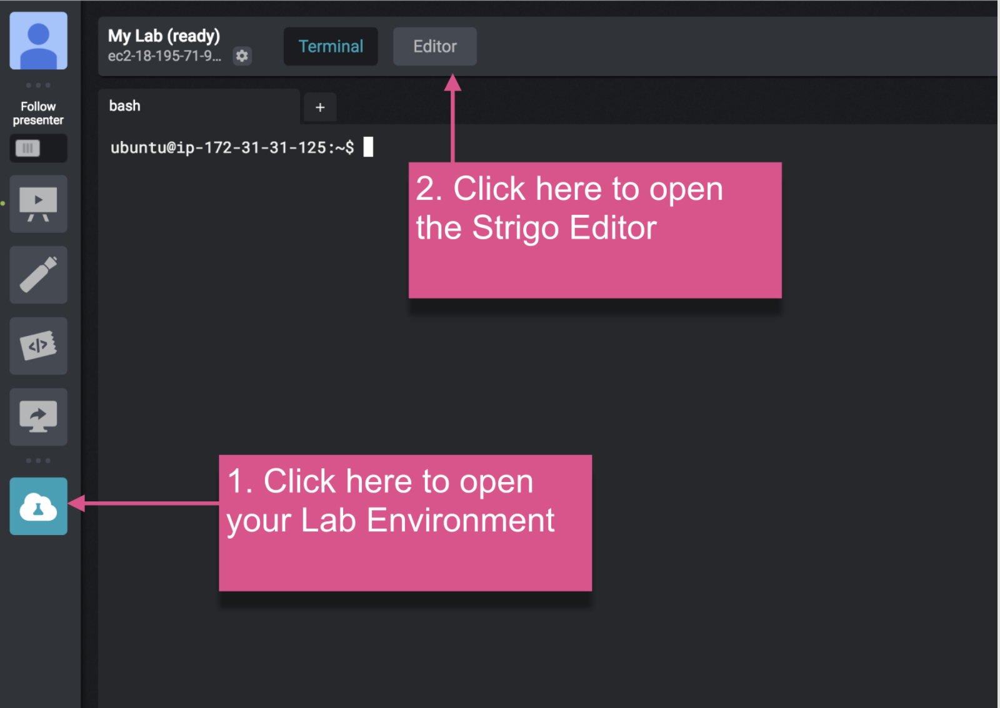

### Editor UI

- **New** - Open a new tab with a file. 
- **Open** - Open a file (default directory is the root).
- **Save** - Save the file.                
- **Save as** - Save the current file with a new name/location.

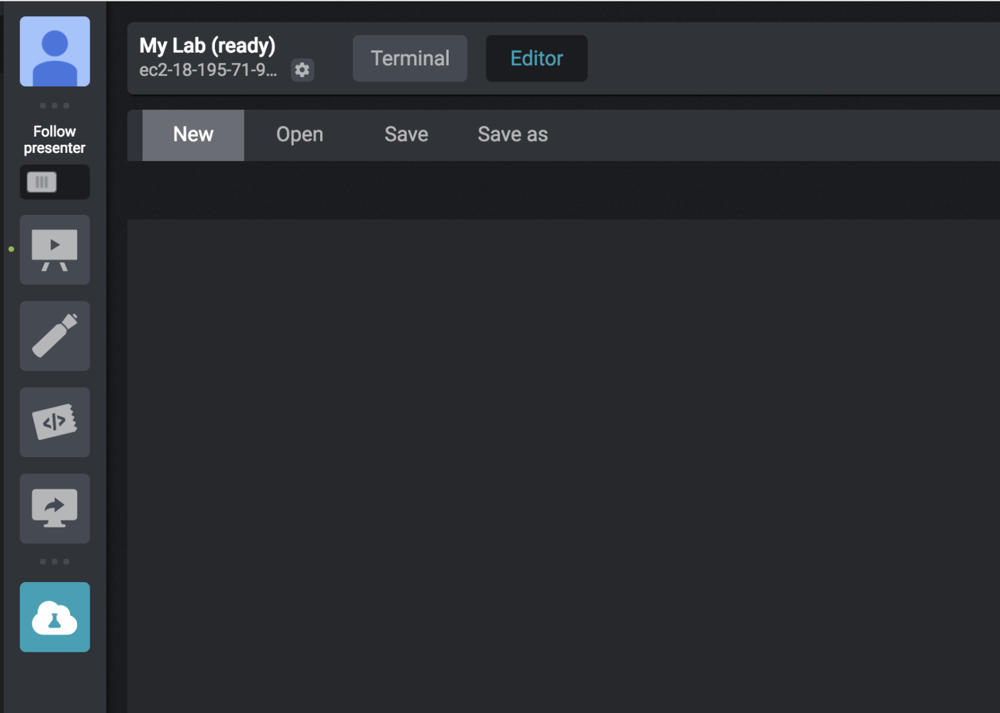
 

### Saving a File
 
After clicking "Save" (located on the top) a dialog will open:  
 
1. Select the directory where the file will be saved (default directory is the
root).
1. Change the file name and the extension.
1. Click on "Save".

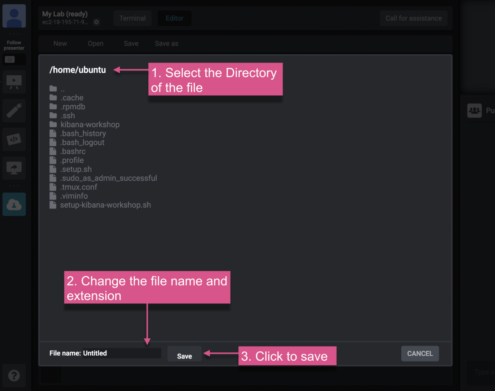

## Opening Kibana

1. Open the Lab Environment.
2. Click on the gear, located on the top left next to your profile picture.
3. Select "Connect from Local" from the menu list.
4. Copy ( ++ctrl++ / ++cmd+"c"++ ) the IP from the "Remote Access" panel.
5. Open a new tab on your browser.
6. In the new tab address bar, paste the IP that you copied.
7. Click on the Kibana link to open it.

!!! note "NOTE:"
    Optionally, you can copy the IPv4 address by double clicking
    the address under "My Lab" and copying ( ++ctrl++ / ++cmd+"c"++ ).

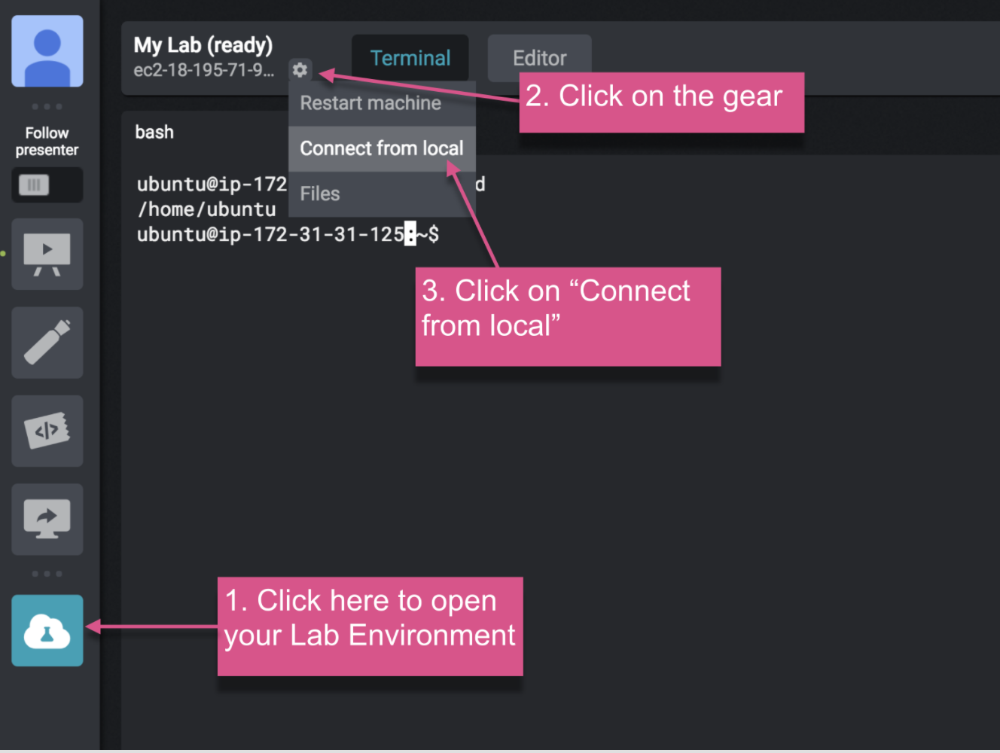

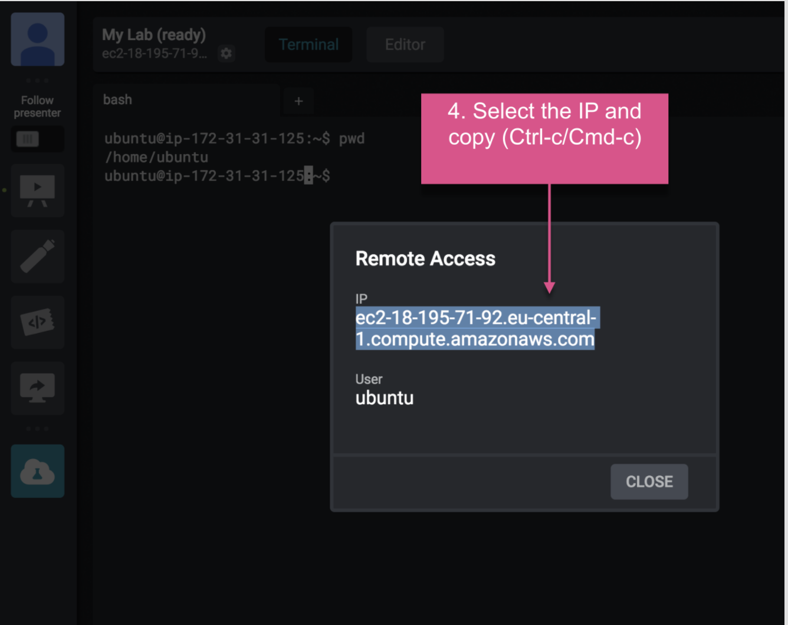

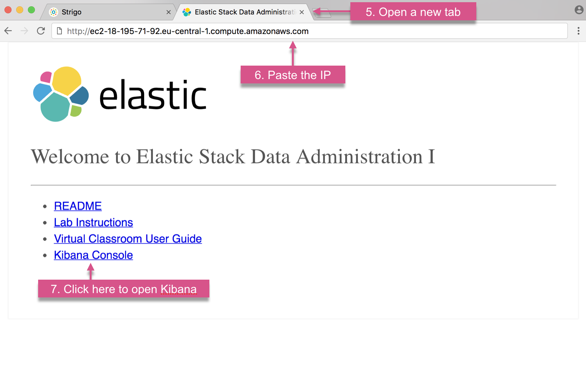

<!-- ## Accessing the Instructions - this section is depricated with unified mkdocs

1. Open the Lab Environment.
2. Click on the gear, located on the top left next to your profile picture.
3. Select "Connect from Local" from the menu list.
4. Copy ( ++ctrl++ / ++cmd+"c"++ ) the IP from the "Remote Access" panel.
5. Open a new tab on your browser.
6. In the new tab address bar, paste the IP that you copied.
7. Click on the instructions link to open it.

!!! note "NOTE:"
    Optionally, you can copy the IPv4 address by double clicking
    the address under "My Lab" and copying ( ++ctrl++ / ++cmd+"c"++ ).  

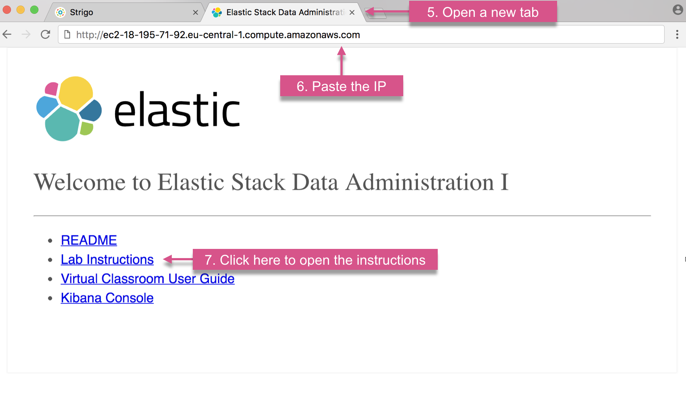 -->