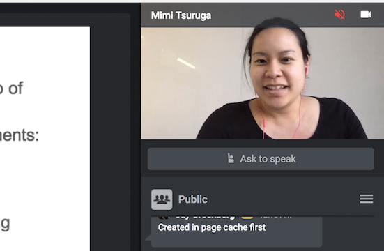
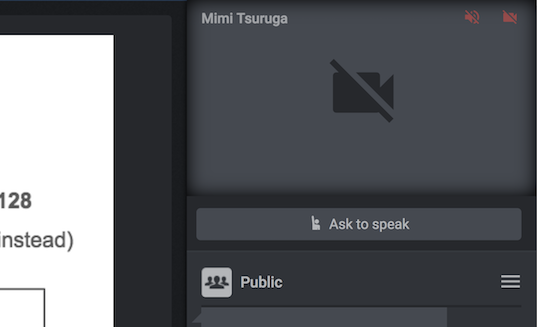

## Troubleshooting Guide

Now that we've covered requirements and basic functionality, let's review some of the 
most common questions that our students ask:  
 

{: .center}

- **"I don't hear the instructor."**
    - Reload the web browser ( ++ctrl++ / ++cmd+"r"++ )
    - Make sure that your web-browser is updated and add-blockers are off
    - Ensure the audio is not turned off inside the virtual class

 

{: .center}

- **"The video stream is not working."**
    - Reload the web browser ( ++ctrl++ / ++cmd+"r"++ )
    - Make sure that TCP port `443` is allowed on your system
    - Check that your browser is updated and add-blockers are off
    - Ensure the stream is not turned off inside the virtual class

 

- **"The instructor is on slide x, but I see slide y."**
    - Toggle the "Follow Presenter" slider switch on (located on the upper left right
below your profile).

 

- **"The IP from the Lab Environment does not work anymore."**
    - The IP from the Lab Environment can be updated, just check if it is still the
same.

 

- **"The video is frozen."**
    - Reload the web browser ( ++ctrl++ / ++cmd+"r"++ ). Also, make sure that your web-browser is
updated and the add-block is turned off.

 

- **"There is a message to update."**
    - Reload the web browser ( ++ctrl++ / ++cmd+"r"++ ), so the virtual classroom can be updated.

 

- **"I reloaded and still the video/sound stops after a while."**
    - Contact the instructor, as other options of streaming are available.

 

- **"The Lab Environment is not loading."**
    - Click on the gear and on "restart machine" (located on the top left next to your
profile picture), it will take up to 15 minutes until the machine restarts.
If you still can not load it, contact the instructor.

 

- **"How long is the virtual classroom available after the end of the course?"**
    - Each course closes in a different time, please contact the instructor.

 

- **"I am having problems to solve the practical exercises, what should I do?"**
    - During the course you can request help from your instructor and work side by
side with the instructor.

 

