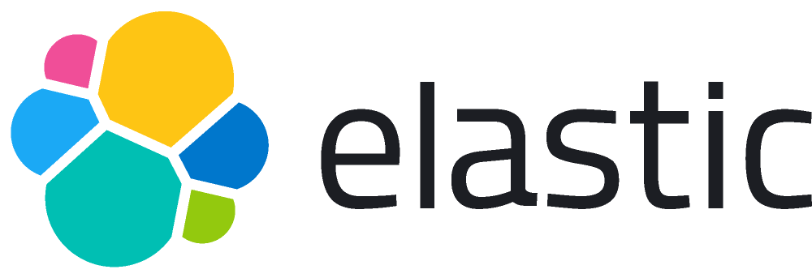

 

# Welcome

Welcome to your Elastic course!

## Getting Started

### Initial Requirements

The virtual classroom video, chat, and lab terminal environment is all contained within a browser window. The following requirements will ensure the best student experience:  

- **Browser**: [Chrome](https://www.google.com/chrome/) (latest) is the recommended browser for virtual trainings
- **Firewall**: traffic allowed must be allowed over `TCP/443` on the client network (this includes video stream)
- **Ad Blockers**: disable any ad-blocker browser plugins
- **Chrome "Incognito"**: while not _required_, connecting to training in incognito mode can prevent additional troubleshooting

### Navigating This Site

This course site includes several keyboard shortcuts that make it possible
to navigate your project documentation via keyboard. There're two main categories:

#### Global Shortcuts

This mode is active when the _searchbar is not focused_. The following keys are bound:

- ++f++ , ++s++ , ++slash++ : open search dialog
- ++p++ , ++comma++ : go to previous page
- ++n++ , ++period++ : go to next page

#### Searchbar

This mode is active when the _search is focused_. It provides several key bindings to make 
search accessible and navigable via keyboard:  

- ++arrow-down++ , ++arrow-up++ : select next / previous result
- ++esc++ , ++tab++ : close search dialog
- ++enter++ : follow selected result

 

---

You can continue by clicking the "**Next**" navigation arrow below.
 
 
