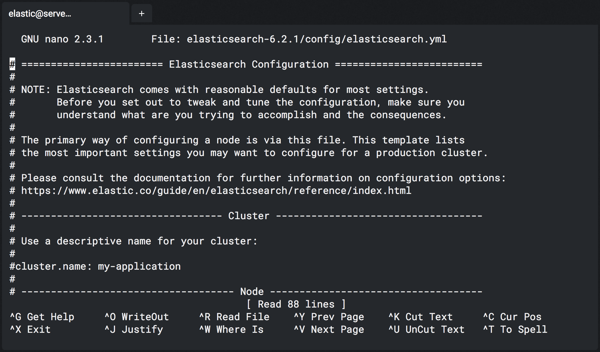

# Nano Tutorial

> "A quick guide to the easy text editor."

Throughout the course labs, you will be asked to `ssh` into different servers and edit
files on those servers. Once you log in, you will find several text editors
available to you: *Vim*, *Emacs* and *Nano*. While *Vim* and *Emacs* are very
powerful, they are also hard to use if you are unfamiliar with these editors.
*Nano* is a much easier option. This guide provides some basic instructions on
how to use Nano.

To edit a specific file, enter the following on the command prompt:

```bash
nano path/to/filename
```

For example, to edit the `elasticsearch.yml` configuration file in the
`elasticsearch-{stack-version}/config` directory, execute the following command:


```bash
nano elasticsearch-{stack-version}/config/elasticsearch.yml
```

Your terminal window you will now show you the Nano user interface. At the top,
you will see the filename of the file that you are editing. Just below that,
the body of the file. And at the bottom of the terminal you will see two rows
with common keyboard shortcuts:



For the keyboard shortcuts, the caret (`^`) symbol shown at the bottom of the
terminal window indicates the ++ctrl++ key on your keyboard. For example, to read
the built-in help text you would hit ++ctrl+"G"++, and then to exit the help text
you would hit ++ctrl+"X"++.

You can use the arrow keys on your keyboard to navigate the cursor to the
position where you want to make changes to the file. You can also use the
++ctrl+"V"++ or ++ctrl+"Y"++ shortcuts to go the next or previous page.

If you wish to save the file, you can hit ++ctrl+"O"++. Nano will ask you to confirm
the filename at the bottom of the terminal window. You can just hit ++enter++ to
keep the current filename.

Finally, if you are done editing the file, you can exit Nano by hitting ++ctrl+"X"++.
If there are any unsaved changes to the file, Nano will ask you whether you wish
to save the file first.